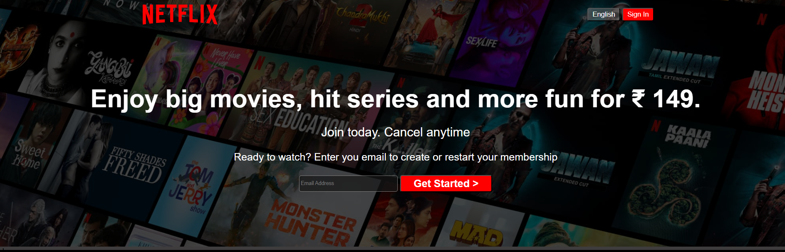
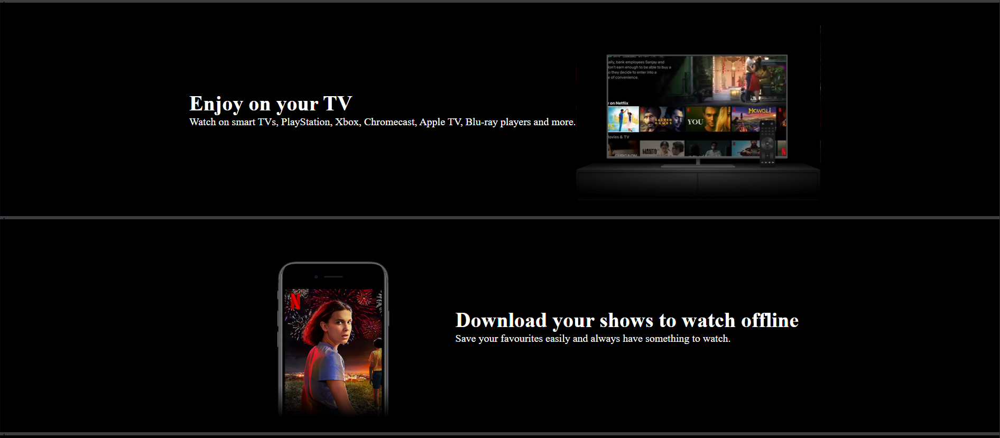
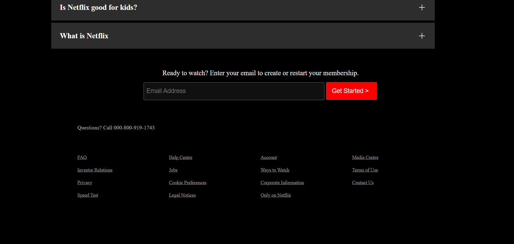

# Netflix Clone

This is a Netflix homepage clone built using HTML and CSS.
The project was created to practice layout design, Flexbox,
and responsive UI development.

## 🛠 Tech Stack
- HTML
- CSS

## 📚 What I Learned
- Structuring web pages using semantic HTML
- Creating layouts using Flexbox
- Handling spacing, alignment, and typography
- Working with background images and overlays
- Improving UI consistency by cloning a real-world website

## ✨ Features
- Netflix-style homepage UI
- Clean and structured layout

## 🚧 Project Status
Completed (for learning purposes)

## ⚠️ Disclaimer
This project is created only for educational purposes.
All design credits belong to Netflix.

## 🌐 Live Demo
 https://harsh-berwal.github.io/movie-streaming-ui/

## 📸 Screenshots

### Homepage

### Features Section

### Footer

<!-- trigger pages rebuild -->
